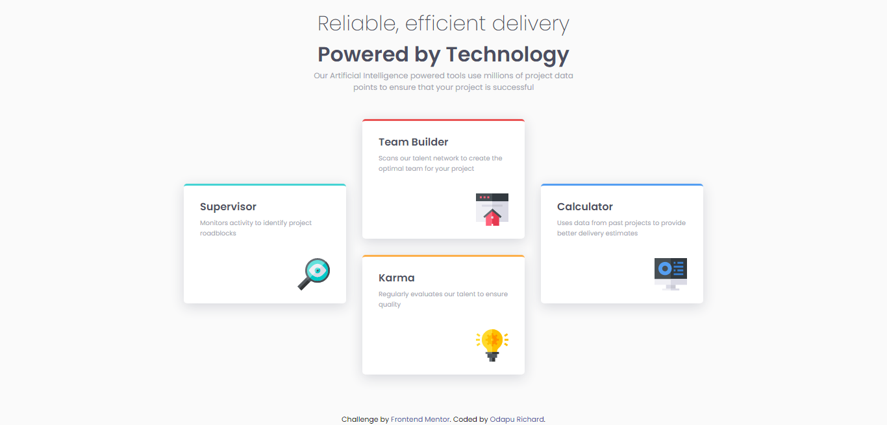

# Frontend Mentor - Four card feature section solution

This is a solution to the [Four card feature section challenge on Frontend Mentor](https://www.frontendmentor.io/challenges/four-card-feature-section-weK1eFYK). Frontend Mentor challenges help you improve your coding skills by building realistic projects. 

## Table of contents

- [Overview](#overview)
  - [The challenge](#the-challenge)
  - [Screenshot](#screenshot)
  - [Links](#links)
- [My process](#my-process)
  - [Built with](#built-with)
  - [What I learned](#what-i-learned)
- [Author](#author)

## Overview

### The challenge

Users should be able to:

- View the optimal layout for the site depending on their device's screen size

### Screenshot




### Links

- Solution URL: [Solution](https://github.com/11-Ace/four-card-feature-section-master)
- Live Site URL: [Link](https://11-ace.github.io/four-card-feature-section-master/)

## My process

### Built with

- Semantic HTML5 markup
- CSS custom properties
- Flexbox

### What I learned

The use of css variables

```css
:root {
  --red: hsl(0, 78%, 62%);
  --cyan: hsl(180, 62%, 55%);
  --orange: hsl(34, 97%, 64%);
  --blue: hsl(212, 86%, 64%);
  --very-dark-blue: hsl(234, 12%, 34%);
  --grayish-blue: hsl(229, 6%, 66%);
  --very-light-gray: hsl(0, 0%, 98%);
}
```

## Author

- Frontend Mentor - [@yourusername](https://www.frontendmentor.io/profile/11=Ace)
- Twitter - [@11-Ace](https://www.twitter.com/@11ace__)